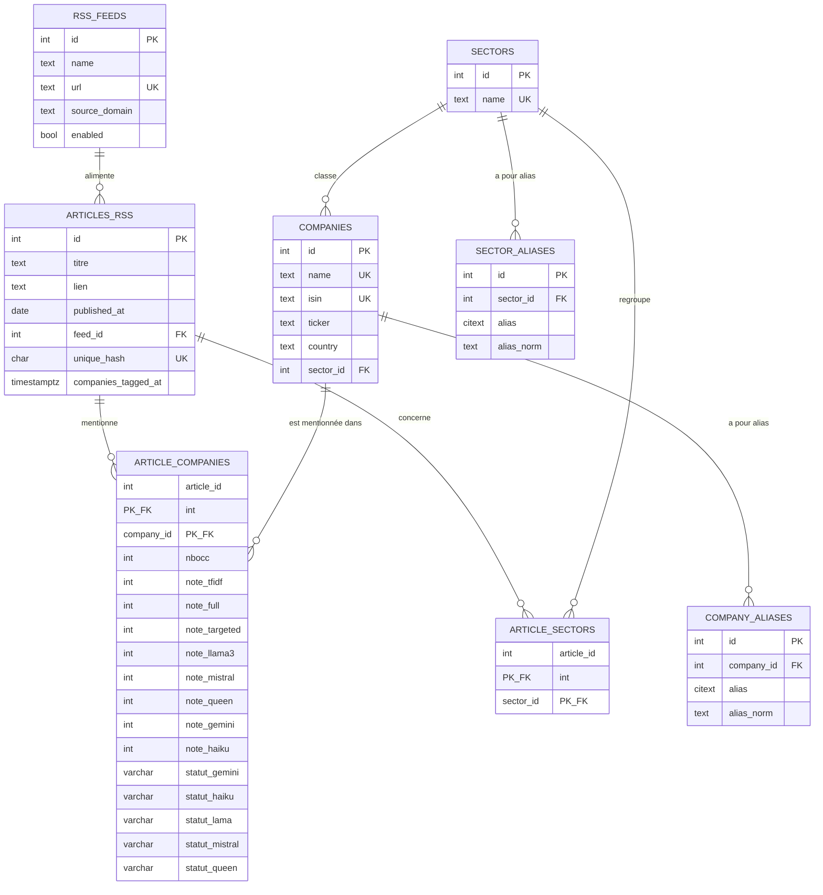

# Analyse de sentiments RSS — CAC40

**Pipeline MLOps de bout en bout pour noter automatiquement le sentiment boursier d'entreprises du CAC40 à partir de flux de presse RSS.**

  

## Contexte

La veille financière REMOVEDelle ne passe pas à l'échelle : des dizaines de dépêches par jour, par entreprise, à noter et croiser avec les cours de bourse. Ce projet automatise cette notation en combinant extraction d'entités, classification par TF-IDF/Transformers et évaluation par LLM, avec une exigence MLOps forte : traçabilité des versions de prompt, gestion des échecs, et arbitrage coût/qualité entre API propriétaires et modèles open-weights hébergés en local.

## Ce que fait le projet

- **Résolution de coréférences** : constitution d'un dictionnaire d'alias par LLM pour identifier une même entreprise sous ses différentes désignations dans la presse (`build_alias_db.py`).
- **Comptage d'occurrences** par entreprise et par article, utilisé comme feature de pondération (`set_company_occurs.py`).
- **Vérité terrain par LLM** : notation `{0, 1, 2}` (négatif/neutre/positif) par couple (article, entreprise), avec Claude Haiku et Gemini 2.5 Flash comme références, et benchmark de modèles locaux via Ollama (Llama 3.1 8B, Qwen 2.5 7B, Mistral NeMo) pour réduire la dépendance à une API payante (`evaluate_article.py`).
- **Benchmark de classification** multi-versions, avec traçabilité des runs (`benchmark_classification.py` + CSV horodatés V1/V2/V3).
- **Classification de sentiment** combinant TF-IDF et Transformers (CamemBERT) (`classifier.py`) — volet correspondant à l'épisode 3 de la série.

## Architecture

```
Flux RSS ──▶ Résolution d'alias (LLM) ──▶ Comptage d'occurrences
                                                    │
                                                    ▼
                         Vérité terrain / évaluation (Claude Haiku, Gemini, Ollama local)
                                                    │
                                                    ▼
                                         PostgreSQL (article_companies)
                                                    │
                                                    ▼
                      Classification (TF-IDF + CamemBERT) — épisode 3
```

**Stack** : Python · PostgreSQL · Docker / docker-compose · Ollama (inférence locale GPU) · API Claude (Anthropic) · API Gemini (Google) · CamemBERT

## Installation

Le dépôt fournit un `Dockerfile` et un `docker-compose.yml` :

```bash
git clone https://github.com/ManDes71/Analyse_de_sentiments_rss_cac40.git
cd Analyse_de_sentiments_rss_cac40
docker compose up --build
```

Pour une installation locale sans Docker, les dépendances Python sont déclarées dans `pyproject.toml`.

> ⚠️ À compléter dans le dépôt : les clés API (Claude, Gemini) et les paramètres de connexion PostgreSQL sont nécessaires au runtime — documenter ici les variables d'environnement attendues (ex. fichier `.env.example`) pour que le projet soit reproductible par un tiers.

Pour le benchmark de modèles locaux, [Ollama](https://ollama.com) doit être installé séparément :

```bash
curl -fsSL https://ollama.com/install.sh | sh
ollama pull llama3.1:8b
ollama pull qwen2.5:7b
ollama pull mistral-nemo
```

## Utilisation

| Script | Rôle |
|---|---|
| `build_alias_db.py` | Génère le dictionnaire d'alias d'entreprises |
| `set_company_occurs.py` | Calcule les occurrences entreprise/article |
| `classifier.py` | Classification de sentiment (TF-IDF + CamemBERT) |
| `evaluate_article.py` | Notation par LLM (API distantes ou Ollama local) et constitution de la vérité terrain |
| `benchmark_classification.py` | Benchmark comparatif des approches de classification |
| `classifier.py` | Classification de sentiment (TF-IDF + CamemBERT) — épisode 3 |

## Résultats clés

Sur le benchmark LLM local vs API (voir détail dans l'article) :

| Modèle | Accord avec Claude Haiku | VRAM (Q4) |
|---|---|---|
| **Llama 3.1 (8B)** | ~75 % | ~4,9 Go |
| Qwen 2.5 (7B) | ~74 %, mais sorties hors-plage récurrentes | ~4,7 Go |
| Mistral NeMo (12B) | ~61 %, sur-classe en Neutre | ~7,1 Go |

Pour référence, deux API de premier plan (Claude Haiku et Gemini 2.5 Flash) ne s'accordent elles-mêmes qu'à 82 % — un rappel que 75 % d'accord n'est pas une équivalence, mais un bon proxy local pour produire de la vérité terrain à moindre coût.

## Pour aller plus loin

Ce dépôt alimente la série d'articles **Market-RSS-Sentiment** sur [aventuresdata.com](https://aventuresdata.com) :
- Épisode 1 — [Extraction d'alias par LLM](https://aventuresdata.com/avant-lanalyse-de-sentiment-boursier-letape-cruciale-de-lextraction-dalias-avec-un-llm/)
- Épisode 2 — Construire sa vérité terrain : quel LLM local pour noter l'actualité boursière ? *(lien à ajouter)*
- Épisode 3 (à venir) — Classification de sentiment par TF-IDF + Transformers (CamemBERT) : un Transformer spécialisé (`bardsai/finance-sentiment-fr-base`) peut-il remplacer un LLM généraliste ?

## Roadmap / limites connues

- Le run v3 du benchmark a été effectué sur un corpus légèrement différent (dérive naturelle de la fenêtre des 100 derniers articles par entreprise) — les chiffres v3 sont indicatifs, pas strictement comparables aux runs v1/v2.
- Qwen 2.5 produit occasionnellement des notes hors du domaine `{0,1,2}`, validées et rejetées explicitement plutôt qu'insérées telles quelles.
- Prochaine étape : évaluer un Transformer spécialisé en finance pour réduire le coût de calcul par rapport à un LLM généraliste 8B.

# Schéma de la base de données — REMOVED



## Notes

- **`article_companies`** est la table centrale du pipeline : clé composite `(article_id, company_id)`, elle porte à la fois le comptage d'occurrences (`nbocc`), les notes de classification (`note_tfidf`, `note_full`, `note_targeted`) et les 5 notes LLM avec leur statut d'évaluation et leur version de prompt — une ligne = un couple (article, entreprise) entièrement tracé.
- **Suppression en cascade** : `article_companies`, `article_sectors` et `company_aliases`/`sector_aliases` sont en `ON DELETE CASCADE` sur leur article/entreprise/secteur parent — supprimer un article ou une entreprise nettoie automatiquement les tables pivot.
- **`sector_id` sur `companies`** est en `ON DELETE SET NULL` : supprimer un secteur ne supprime pas les entreprises, il les détache juste.
- **Recherche plein texte** : `articles_rss` a un index GIN sur `to_tsvector('french', titre || contenu)` pour la recherche full-text.
- **Normalisation des alias** : les colonnes `alias_norm` de `company_aliases`/`sector_aliases` sont remplies automatiquement par trigger (`lower(alias)`), avec un index unique `(company_id, alias_norm)` pour éviter les doublons insensibles à la casse.

## Licence & auteur

Auteur : [ManDes71](https://github.com/ManDes71) — *licence à préciser dans le dépôt.*
